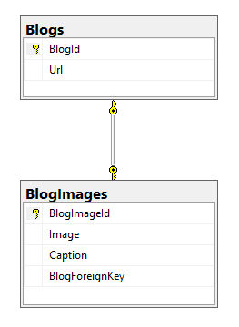

### OneToOne FluentAPI

[Docs: One-to-one Fluent API](https://docs.microsoft.com/en-us/ef/core/modeling/relationships#one-to-one)

[EF Tutorial: One-to-one Fluent API](https://www.entityframeworktutorial.net/efcore/configure-one-to-one-relationship-using-fluent-api-in-ef-core.aspx)

