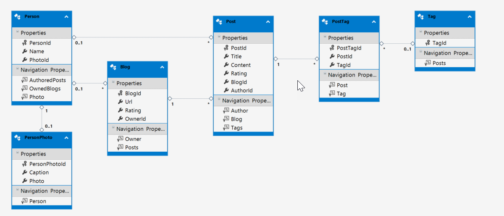

# Many-to-many Fluent API
[Docs: Many-to-many Fluent API](https://docs.microsoft.com/en-us/ef/core/modeling/relationships#many-to-many)

[EF Tutorial: Many-to-many Fluent API](https://www.entityframeworktutorial.net/efcore/configure-many-to-many-relationship-in-ef-core.aspx)

