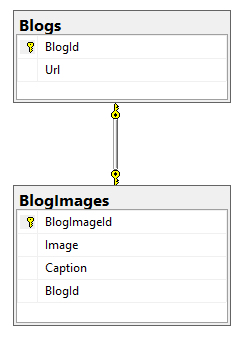

## OneToOne with Conventions

[Docs: One-to-one](https://docs.microsoft.com/en-us/ef/core/modeling/relationships#one-to-one)

[EF Tutorial: One-to-one](https://www.entityframeworktutorial.net/efcore/one-to-one-conventions-entity-framework-core.aspx)

_)