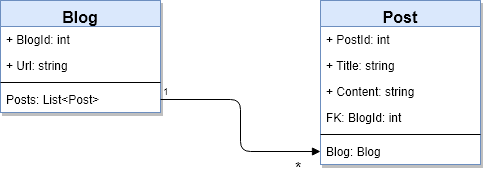

# OneToMany Convention

[Docs: Relationships](https://docs.microsoft.com/en-us/ef/core/modeling/relationships)

[Entity Framework Tutorial - One-to-Many](https://www.entityframeworktutorial.net/efcore/one-to-many-conventions-entity-framework-core.aspx)

